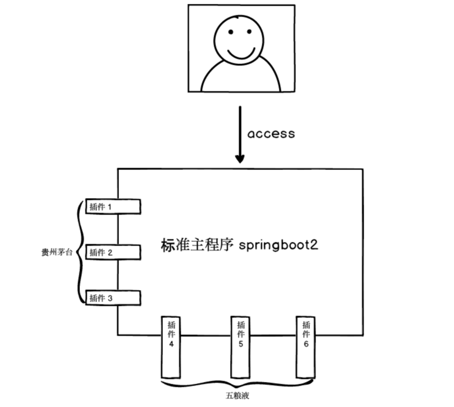
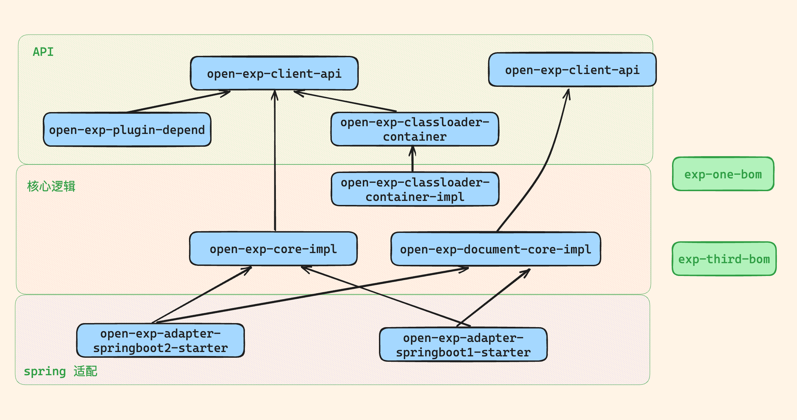

## ⭐️⭐️⭐️Introduction

🚕🚕🚕EXP (Extension Plugin) Extension Point Plugin System


Related Articles 🎯🎯🎯[EXP: A Java Plugin Hot-Swapping Framework](http://thinkinjava.cn/2023/08/15/2023/exp/)

Noun Definitions:

🏅 Main Application:
EXP needs to run on a JVM, typically as a Spring Boot application, which is referred to as the main application.

🎖 Extension Point:
An interface defined by the main application that can be implemented by plugins. It's important to note that plugins are concrete implementations of extension points, while extension points themselves are merely interface definitions. A plugin can contain implementations for multiple extension points, and a single extension point can have implementations from multiple plugins.

🥇 Plugin:
Supports extending functionality through a plugin mechanism, similar to plugins in tools like IDEA or Eclipse. The code within a plugin follows a format similar to Spring (if your application operates within a Spring environment).

🥈 Hot Swapping:
Plugins have the ability to be removed from the JVM and Spring container. They support dynamic installation of JAR and ZIP files at runtime. This means you can add, remove, or replace plugins while the application is running, enabling dynamic extension and upgrades of the system.

The above translations describe the terms and definitions related to the EXP (Extension Plugin) Extension Point Plugin System. This system allows you to build applications with dynamic extension capabilities, adding and managing new functional modules through the use of plugins in the main application.

## 🎧Example

Both Guizhou Maotai and Wuliangye have purchased your company's standard products. However, due to custom requirements from the clients, new features need to be developed.

- Guizhou Maotai has customized 2 plugins.
- Wuliangye has customized 3 plugins.
- During runtime, the program will perform logic switching based on the client's tenant ID.



Scenario:

- Large B2B customers customize their business processes, requiring extensions to the main codebase.

  - The conventional approach involves pulling branches from Git.
  - The current method employs an extension point-based approach for customization, allowing hot-swapping.
- Multiple programs need to be divisible and combinable, supporting the deployment of multiple Spring Boot applications as a single unit or separately.

- Extension points are similar to Swagger documentation, serving as documentation for the plugin system, which is showcased on the management platform.

## Feature

1. Support hot-swapping or loading during startup (Spring or regular JVM).
2. Based on the classloader Parent First isolation mechanism.
3. Support multiple implementations for a single extension point in a multi-tenant scenario, with tenant-based filtering for business logic, and customizable sorting for multiple tenant implementations.
4. Compatible with Spring Boot 3.x/2.x/1.x dependencies.
5. Enable plugins to expose Spring Controller REST endpoints externally, with hot-swapping capability.
6. Allow plugins to override Spring main application Controllers.
7. Provide support for plugins to access exclusive configurations, enabling customizable design for hot-reloading plugin configurations.
8. Support transaction binding between plugins and the main application.
9. Offer a fluent API to ensure a cleaner integration of extension points into the main application.

## USE

Environment:

1. JDK 1.8
2. Maven

```shell
git clone git@github.com:stateIs0/exp.git
cd all-package
mvn clean package
```

Main Application Dependencies(springboot starter)

```xml

<dependency>
    <groupId>cn.think.in.java</groupId>
    <!-- Here is a Spring Boot 2 example. If it's a regular application or a Spring Boot 1/3 application, please replace the artifactId.  -->
    <artifactId>open-exp-adapter-springboot2-starter</artifactId>
</dependency>
```

Plugin Dependencies

```xml
<dependency>
   <groupId>cn.think.in.java</groupId>
   <artifactId>open-exp-plugin-depend</artifactId>
</dependency>
```

## Using the Programming Interface API

```java
ExpAppContext expAppContext = ExpAppContextSpiFactory.getFirst();

public String run(String tenantId) {
   List<UserService> userServices = expAppContext.get(UserService.class, TenantCallback.DEFAULT);
   // first 第一个就是这个租户优先级最高的.
   Optional<UserService> optional = userServices.stream().findFirst();
   if (optional.isPresent()) {
       optional.get().createUserExt();
   } else {
       return "not found";
   }
}


public String install(String path, String tenantId) throws Throwable {
  Plugin plugin = expAppContext.load(new File(path));
  return plugin.getPluginId();
}

public String unInstall(String pluginId) throws Exception {
  log.info("plugin id {}", pluginId);
  expAppContext.unload(pluginId);
  return "ok";
}
```

## 模块

1. [all-package](all-package) 打包模块
2. [bom-manager](bom-manager) pom 管理, 自身管理和三方依赖管理
    - [exp-one-bom](bom-manager%2Fexp-one-bom) 自身包管理
    - [exp-third-bom](bom-manager%2Fexp-third-bom) 三方包管理
3. [open-exp-code](open-exp-code) exp 核心代码
    - [open-exp-classloader-container](open-exp-code%2Fopen-exp-classloader-container) classloader 隔离 API
    - [open-exp-classloader-container-impl](open-exp-code%2Fopen-exp-classloader-container-impl) classloader 隔离 API
      具体实现
    - [open-exp-client-api](open-exp-code%2Fopen-exp-client-api) 核心 api 模块
    - [open-exp-core-impl](open-exp-code%2Fopen-exp-core-impl) 核心 api 实现; 内部 shade cglib 动态代理, 可不以来 spring
      实现;
    - [open-exp-document-api](open-exp-code%2Fopen-exp-document-api) 扩展点文档 api
    - [open-exp-document-core-impl](open-exp-code%2Fopen-exp-document-core-impl) 扩展点文档导出实现
    - [open-exp-object-field-extend](open-exp-code%2Fopen-exp-object-field-extend) 字节码动态扩展字段模块
    - [open-exp-plugin-depend](open-exp-code%2Fopen-exp-plugin-depend) exp 插件依赖
4. [example](example) exp 使用示例代码
    - [example-extension-define](example%2Fexample-extension-define) 示例扩展点定义
    - [example-plugin1](example%2Fexample-plugin1) 示例插件实现 1
    - [example-plugin2](example%2Fexample-plugin2) 示例插件实现 2
    - [example-springboot1](example%2Fexample-springboot1) 示例 springboot 1.x 例子
    - [example-springboot2](example%2Fexample-springboot2) 示例 springboot 2.x 例子; 使用 spring cglib 动态代理
5. [spring-adapter](spring-adapter) springboot starter, exp 适配 spring boot
    - [open-exp-adapter-springboot2](spring-adapter%2Fopen-exp-adapter-springboot2-starter)  springboot2 依赖
    - [open-exp-adapter-springboot1-starter](spring-adapter%2Fopen-exp-adapter-springboot1-starter) springboot1 依赖
    - https://github.com/stateIs0/open-exp-springboot3 springboot3 依赖

## module dependency



## core API

```java
public interface ExpAppContext {
   /**
    * Gets all current plug-in ids
    */
   List<String> getAllPluginId();
   
   /**
    * Preload reads only the meta information and load boot class and configuration, and does not load beans.
    */
   Plugin preLoad(File file);
   
   /**
    * loading plugin
    */
   Plugin load(File file) throws Throwable;

   /**
    * Uninstall plugin
    */
   void unload(String pluginId) throws Exception;

   /**
    * Gets plug-in instances for multiple extension points
    */
   <P> List<P> get(String extCode);


   /**
    * To simplify the operation, code is the full path class name
    */
   <P> List<P> get(Class<P> pClass);


   /**
    * Gets a single plug-in instance.
    */
   <P> Optional<P> get(String extCode, String pluginId);
}
```

## Streaming API

```java
public interface StreamAppContext {

   /**
    * For apis with return values, you need to support streaming calls
    */
   <R, P> R streamList(Class<P> pClass, Ec<R, List<P>> ecs);

   /**
    * For apis with return values, you need to support streaming calls
    */
   <R, P> R stream(Class<P> clazz, String pluginId, Ec<R, P> ec);
}
```

## extension

cn.think.in.java.open.exp.client.TenantCallback

```java
public interface TenantCallback {

   /**
    * Returns the serial number of the plugin, default 0;
    * {@link  cn.think.in.java.open.exp.client.ExpAppContext#get(java.lang.Class)} 函数返回的List 的第一位就是 sort 最高的.
    */
   int getSort(String pluginId);

   /**
    * Whether the plug-in belongs to the current tenant. The default is yes. 
    * the return value, it will affect {@ link cn. Think. In. Java. Open. Exp. Client. ExpAppContext# get (Java. Lang. Class)} 
    * If the plugin implementation is filtered and returns true, it will be returned.
    */
   boolean filter(String pluginId);
}
```

Tenant filtering example code:

````java
TenantCallback registerCallback = new TenantCallback() {
   @Override
   public int getSort(String pluginId) {
       // Getting the Sorting of This Plugin
        return sortMap.get(pluginId);
   }

   @Override
   public boolean filter(String pluginId) {
       // Determine if the current tenant matches this plugin
        return context.get().equals(pluginIdTenantIdMap.get(pluginId));
   }
}
;
List<UserService> userServices = expAppContext.get(UserService.class, registerCallback);
// first The first is the tenant's highest priority.
Optional<UserService> optional = userServices.stream().findFirst();
````

Here's an example code snippet demonstrating how a plugin can retrieve configuration:

```java
public class Boot extends AbstractBoot {
    // 定义配置, key name 和 Default value;
   public static ConfigSupport configSupport = new ConfigSupport("bv2", null);
}
public String hello() {
   return configSupport.getProperty();
}
```

springboot config(-D or application.yml):

```java
plugins_path={Plugin directory that exp actively loads when springboot starts}
plugins_work_dir={exp's working directory, which will extract the code into this directory, subdirectory named plugin id}
plugins_auto_delete_enable={Whether to automatically delete the existing plugin directory}
plugins_spring_url_replace_enable={Whether the plug-in can override the main program url, note that multi-tenant level override is not currently supported}
exp_object_field_config_json={The plug-in dynamically adds fields json, json 结构定义见: cn.think.in.java.open.exp.object.field.ext.ExtMetaBean}
```

## License

[Apache 2.0 License.](https://github.com/stateIs0/exp/blob/master/LICENSE)

## Stargazers over time

[](https://starchart.cc/stateIs0/exp)

